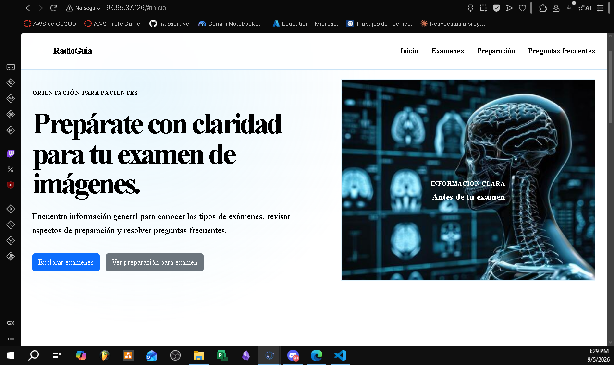

# RadioGuía - EV1

Desarrollado por Keiton Chaves y Matias Chavez

Es una landing page informativa orientada a pacientes que se preparan para sus exámenes de imágenes médicas (radiografía, ecografía, tomografía y resonancias magnéticas). Este es un proyecto desarrollado como parte de la Evaluación Parcial 1 de la asignatura DOY0101 - Ingeniería DevOps.

# Descripción del Proyecto
RadioGuía entrega orientación general sobre que esperar antes de un examen de imágenes: tipos de estudios, pasos de preparación y respuestas a preguntas frecuentes. Es un sitio simple que emplea tecnologías como HTML, CSS y JS desplegado automáticamente dentro de una instancia EC2 de AWS Academy mediante Github Actions.

# Estrategia de Ramas
Este repositorio se acoge al modelo de ramificación "GitFlow". Esto debido que
° El proyecto es colaborativo, no hay un único desarrollador involucrado y GitFlow define roles claros para cada tipo de cambio (feature o hotfix), facilitando la coordinación de trabajo sin pisar cambios.

° develop actua como una rama de integración continua, mientras main es la que siempre se mantiene estable (ya que es la que está en producción)

° hotfix será para los cambios urgentes sobre main sin esperar el ciclo completo de la rama develop.

# Pipeline CI/CD - Github Actions
° El workflow definido en .github/workflows/deploy.yml automatiza el despliegue del sitio hacia una instancia EC2 de AWS Academy. Su rol del proceso CI/CD es el siguiente: 

° Integración continua: cada push a develop y cada Pull Request hacia main disparan el workflow, permitiendo detectar problemas de despliegue antes de que el cambio llegue a producción.

° Entrega continua: cada push a main ejecuta el despliegue automático hacia la instancia EC2, copiando los archivos del sitio vía SSH/SCP y reiniciando el servicio Apache (httpd), sin intervención manual.

° Gestión de credenciales: las credenciales de acceso (clave SSH, host y usuario) se almacenan como GitHub Secrets (AWS_SSH_KEY, AWS_HOST, AWS_USER), evitando exponer información sensible en el código.

° Control de concurrencia: el workflow usa concurrency con cancel-in-progress: true para evitar que dos despliegues se ejecuten en paralelo y corrompan el estado del servidor.

Las decisiones de arquitectura, la elección de GitFlow, y el desarrollo del código fuente (HTML, CSS, JavaScript y el workflow de GitHub Actions) fueron realizadas y validadas por el duo. Toda justificación técnica y reflexión de aprendizaje fue redactada por los integrantes a conciencia.

# Licencia
Este proyecto se distribuye bajo licencia MIT con fines solamente educativos. Consulte el archivo LICENSE para más información.

# Reflexiones individuales

Matias: Fue un trabajo interesante, desde el armado del frontend hasta su despliegue, me sirvió para repasar conocimientos previos que teniamos anteriormente con
lo que era desplegar una página, eso si lo que me complicó un poco era adaptar el deploy.yml donde tuve que guiarme con el ejemplo del profesor para acordarme
y estructurarlo para este trabajo.

Keiton: Me sirvió para reforzar conocimientos de como era un despliegue en aws, a su vez repasar un poco de desarrollo web en donde maquetamos la vista y hacerlo responsive

# Fotorgrafia de evidencia
Foto que evidencia que la web se muestra sobre una ip pública de la ec2
